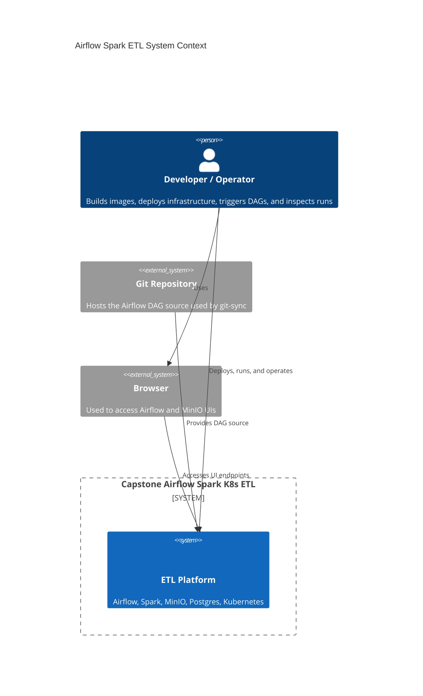
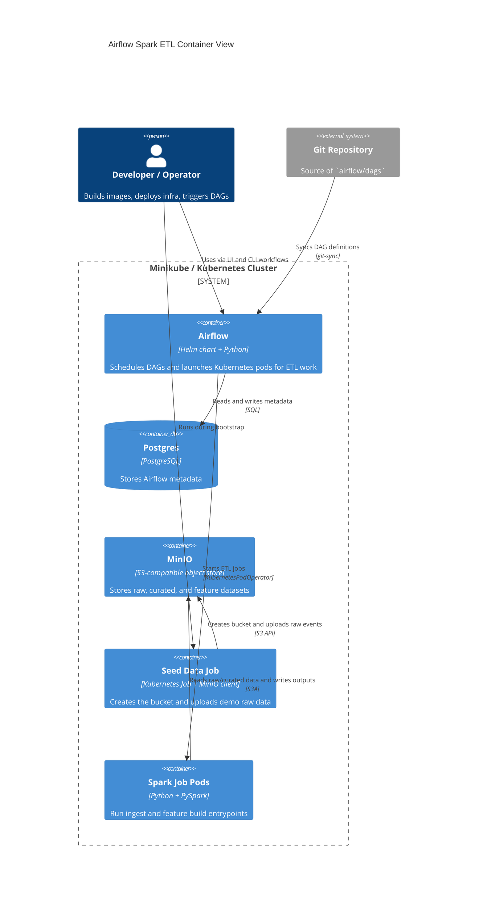
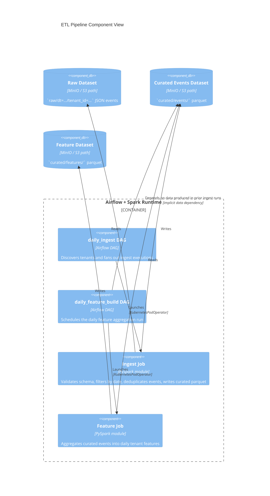

# Architecture

This document describes the system using C4-style Mermaid diagrams. The diagrams reflect the current local deployment model in this repository: Airflow on Kubernetes, Spark jobs launched as pods, MinIO as S3-compatible storage, and Postgres for Airflow metadata.

## System Context

Notes:

- The primary actor is an engineer or operator, not an end-user application.
- The repo supplies orchestration code through Airflow `git-sync`; Spark job code is baked into the runtime image.
- The system is modeled as one deployable platform for the context view, even though it contains multiple containers internally.

## Container View

Notes:

- Airflow is the control plane; Spark pods are short-lived execution containers.
- Postgres is only used for Airflow metadata in this repo, not for pipeline business data.
- MinIO stands in for S3 in local development and stores all ETL datasets.
- The seed job is operational bootstrap glue, not part of the steady-state daily pipeline.

## Component View

Notes:

- The DAGs are intentionally thin and orchestration-focused; transformation logic lives in the PySpark jobs.
- `daily_ingest` fans out by tenant, while `daily_feature_build` is a single daily aggregation step.
- The dependency between ingest and feature build is currently data-driven rather than enforced as one composed DAG.
- The component view models storage paths as components because the pipeline contract is path-oriented.

## Modeling Notes

- These are C4-style diagrams rendered with Mermaid syntax, not PlantUML C4 macros.
- The container/component boundaries are logical and optimized for explanation, not a literal one-to-one mapping to every pod created at runtime.
- If the repo later adds a shared `src/` package, that would fit naturally into the component view as shared library code used by the DAG and job entrypoints.
